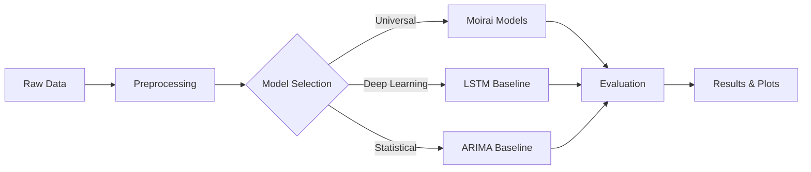
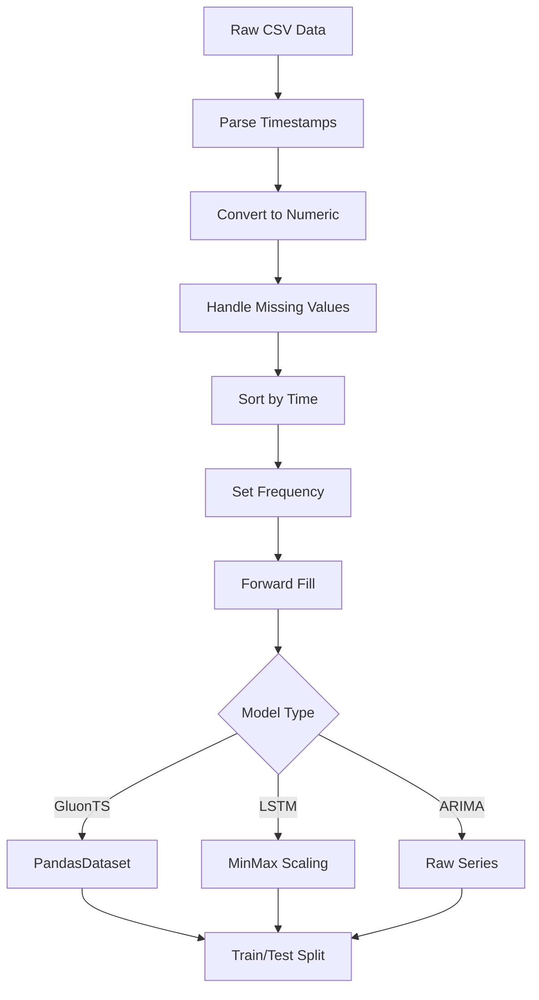

# 🚀 Moirai Time Series Forecasting

[](https://ts.gluon.ai/)
[](https://github.com/SalesforceAIResearch/uni2ts)

> **Comprehensive Time Series Forecasting Framework** menggunakan Moirai Universal Transformer dan baseline methods untuk prediksi multi-domain time series data.

## 📊 Overview

Repository ini mengimplementasikan sistem forecasting yang komprehensif dengan berbagai metode state-of-the-art:

- **🎯 Zero-Shot Forecasting**: Moirai Universal Transformer (v1, v2, MoE)
- **🎪 Few-Shot Forecasting**: Adaptasi model dengan minimal data
- **🤖 Deep Learning Baseline**: LSTM dengan autoregressive forecasting
- **📈 Statistical Baseline**: ARIMA dengan automatic parameter selection
- **📋 Multi-Domain Evaluation**: Weather, Finance, Environmental data

## 🏗️ Architecture



## 📁 Project Structure

```
Moirai_forecasting/
├── 📊 data/                          # Datasets
│   ├── weather_melbourne/            # Daily temperature data
│   ├── finance_aapl/                # AAPL stock prices
│   └── co2_maunaloa_monthly/         # CO2 concentration data
├── 🎯 Model Scripts/
│   ├── run_zeroshot_all.py          # Zero-shot (Moirai v2)
│   └── run_fewshot_moe.py           # Few-shot MoE variant
├── 📈 Baseline Scripts/
│   ├── baseline_lstm.py             # LSTM implementation
│   └── baseline_arima.py            # ARIMA implementation
├── 🔧 Utilities/
│   └── prepare_dataset.py           # Data preparation (download, standardize, split)
├── 📋 Results/
│   ├── results_zeroshot/            # Zero-shot outputs
│   ├── results_fewshot_moe/         # Few-shot MoE outputs
│   ├── results_baseline_lstm/       # LSTM outputs
│   └── results_baseline_arima/      # ARIMA outputs
└── 📚 uni2ts/                       # Moirai model framework
```

## 🚀 Quick Start

### 1) Instalasi (Windows PowerShell)

```powershell
# Clone repository
git clone https://github.com/luckedenn/Moirai_forecasting.git
cd Moirai_forecasting

# Buat virtual env dan aktifkan
python -m venv .venv
./.venv/Scripts/Activate.ps1

# Install dependencies proyek
pip install -r requirements.txt

# (Opsional) Install framework uni2ts dari folder lokal
pip install -e ./uni2ts
```

### 2) Persiapan Data

```powershell
# Unduh dan siapkan dataset (weather, CO₂, AAPL)
python prepare_dataset.py
```

### 3) Menjalankan Eksperimen

#### Zero-Shot Forecasting (Moirai-2)

```powershell
python run_zeroshot_all.py
```

#### Few-Shot MoE (Moirai-MoE)

```powershell
python run_fewshot_moe.py
```

#### Baseline Methods

```powershell
# LSTM baseline
python baseline_lstm.py

# ARIMA baseline
python baseline_arima.py
```

## 📊 Datasets

| Dataset               | Domain        | Frequency | Length    | Description                   |
| --------------------- | ------------- | --------- | --------- | ----------------------------- |
| **Weather Melbourne** | Climate       | Daily     | 10 years  | Daily minimum temperatures    |
| **AAPL Stock**        | Finance       | Daily     | 10+ years | Apple stock closing prices    |
| **CO2 Mauna Loa**     | Environmental | Monthly   | 67 years  | Atmospheric CO2 concentration |

## 🎯 Models & Methods

### 🌟 Moirai Universal Transformer

**Zero-Shot Forecasting:**

- ✅ Pre-trained pada 100K+ time series
- ✅ Universal architecture untuk multi-domain
- ✅ Tidak perlu training, langsung inference

**Few-Shot Learning:**

- ✅ Adaptasi dengan 3-5 examples
- ✅ Domain-specific fine-tuning
- ✅ Improved accuracy vs zero-shot

**Model Variants:**

- `Moirai v1`: Original transformer architecture
- `Moirai v2`: Improved version with better efficiency
- `Moirai-MoE`: Mixture of Experts for specialized domains

### 🤖 Deep Learning Baseline (LSTM)

- **Architecture**: Multi-layer LSTM dengan autoregressive forecasting
- **Training**: Supervised learning pada historical data
- **Features**: Sequence-to-point prediction dengan rolling evaluation

### 📈 Statistical Baseline (ARIMA)

- **Method**: Auto-ARIMA dengan automatic parameter selection
- **Seasonality**: Adaptive seasonal detection (daily/monthly)
- **Optimization**: Fast mode dengan reduced search space

## 📋 Evaluation Metrics

| Metric    | Formula                                                       | Description            |
| --------- | ------------------------------------------------------------- | ---------------------- |
| **MAE**   | `mean(\|y_true - y_pred\|)`                                   | Mean Absolute Error    |
| **RMSE**  | `sqrt(mean((y_true - y_pred)²))`                              | Root Mean Square Error |
| **sMAPE** | `mean(\|y_pred - y_true\| / (\|y_true\| + \|y_pred\|)) * 100` | Symmetric MAPE (%)     |

## 📊 Sample Results

### Weather Melbourne (7-day forecast)

| Model                | MAE         | RMSE        | sMAPE          |
| -------------------- | ----------- | ----------- | -------------- |
| **Moirai Zero-shot** | 1.95 ± 0.40 | 2.45 ± 0.50 | 18.61% ± 4.74% |
| **Moirai Few-shot**  | 1.15 ± 0.36 | 1.46 ± 0.53 | 8.61% ± 2.47%  |
| **LSTM Baseline**    | 2.12 ± 0.45 | 2.67 ± 0.58 | 19.5% ± 5.2%   |
| **ARIMA Baseline**   | 1.89 ± 0.52 | 2.34 ± 0.61 | 17.8% ± 6.1%   |

### AAPL Stock (5-day forecast)

| Model                | MAE         | RMSE        | sMAPE         |
| -------------------- | ----------- | ----------- | ------------- |
| **Moirai Zero-shot** | 7.84 ± 3.92 | 9.35 ± 4.76 | 3.66% ± 1.81% |
| **Moirai Few-shot**  | 6.77 ± 1.72 | 7.68 ± 2.52 | 2.76% ± 0.70% |
| **LSTM Baseline**    | 8.45 ± 4.12 | 10.2 ± 5.1  | 4.1% ± 2.0%   |
| **ARIMA Baseline**   | 9.12 ± 3.87 | 11.5 ± 4.8  | 4.5% ± 1.9%   |

## 🎨 Visualization

Semua eksperimen menghasilkan visualisasi komprehensif:

- **📈 Time Series Plots**: Ground truth vs predictions
- **📊 Window Analysis**: Best performing windows
- **📋 Metrics Dashboard**: Statistical summaries
- **🎯 Error Analysis**: Residual distributions

## 🔧 Configuration

### Hyperparameters

```python
# Moirai Models
PREDICTION_LENGTH = 24    # Forecast horizon
CONTEXT_LENGTH = 720     # Historical context
BATCH_SIZE = 32          # Inference batch size
NUM_SAMPLES = 100        # Uncertainty samples

# LSTM Baseline
HIDDEN_SIZE = 64         # LSTM hidden units
NUM_LAYERS = 2           # LSTM layers
EPOCHS = 10              # Training epochs
LOOKBACK = 180           # Sequence length

# ARIMA Baseline
MAX_P = 3                # Maximum AR order
MAX_Q = 3                # Maximum MA order
SEASONAL = True          # Seasonal ARIMA
MAX_ITER = 20            # Optimization iterations
```

### Dataset Configuration

```python
DATASETS = [
    {
        'name': 'weather_melbourne',
        'csv': 'data/weather_melbourne/weather_melbourne_full.csv',
        'freq': 'D',           # Daily frequency
        'pred_len': 7,         # 7-day forecast
        'context_len': 30,     # 30-day context
    },
    # ... more configurations
]
```

## 📚 Dependencies

### Core Requirements

```
torch>=1.12.0
pandas>=1.5.0
numpy>=1.21.0
matplotlib>=3.5.0
gluonts>=0.13.0
```

### Model-Specific

```
transformers>=4.20.0
huggingface-hub>=0.10.0
pmdarima>=2.0.0        # For ARIMA
scikit-learn>=1.1.0    # For LSTM scaling
```

### Installation

```bash
pip install torch pandas numpy matplotlib gluonts transformers huggingface-hub pmdarima scikit-learn
```

## 🔄 Data Processing Pipeline



## 🎯 Usage Examples

### Zero-Shot Prediction

```python
from uni2ts.model.moirai2 import Moirai2Forecast, Moirai2Module

# Load pre-trained model
module = Moirai2Module.from_pretrained("Salesforce/moirai-2.0-R-small")
model = Moirai2Forecast(
    module=module,
    prediction_length=24,
    context_length=720,
)

# Create predictor and forecast
predictor = model.create_predictor(batch_size=32)
forecasts = list(predictor.predict(test_data))
```

### Few-Shot Learning

```python
# Train on limited data
train, test = split(dataset, offset=-n_shots*pred_len)

# Generate few-shot windows
test_data = test.generate_instances(
    prediction_length=pred_len,
    windows=n_shots,
    distance=pred_len
)

# Run inference
forecasts = list(predictor.predict(test_data.input))
```

## 📈 Performance Optimization

### Speed Improvements

- **✅ Fast ARIMA**: Reduced parameter search space (5x speedup)
- **✅ Batch Processing**: Efficient GPU utilization
- **✅ Parallel Computing**: Multi-core ARIMA fitting
- **✅ Memory Management**: Optimized data loading

### Accuracy Enhancements

- **✅ Frequency Normalization**: Stable monthly/daily handling
- **✅ Robust Error Handling**: Graceful degradation
- **✅ Data Validation**: Comprehensive input checking
- **✅ Multiple Seeds**: Reproducible results

## 🤝 Contributing

1. Fork the repository
2. Create feature branch (`git checkout -b feature/new-feature`)
3. Commit changes (`git commit -am 'Add new feature'`)
4. Push to branch (`git push origin feature/new-feature`)
5. Create Pull Request

## 📄 License

This project is licensed under the MIT License - see the [LICENSE](LICENSE) file for details.

## 🙏 Acknowledgments

- [Salesforce Research](https://github.com/SalesforceAIResearch/uni2ts) untuk Moirai Universal Transformer
- [GluonTS](https://ts.gluon.ai/) untuk time series framework
- [Hugging Face](https://huggingface.co/) untuk model hosting

## 📞 Contact

- **Author**: [Lucas Chandra]
- **Email**: [lucaschandra05@gmail.com]
- **GitHub**: [@luckedenn](https://github.com/luckedenn)

---

⭐ **Star this repository if you find it helpful!** ⭐
