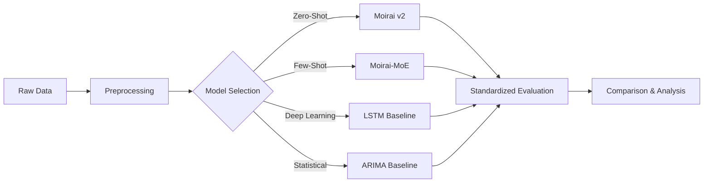
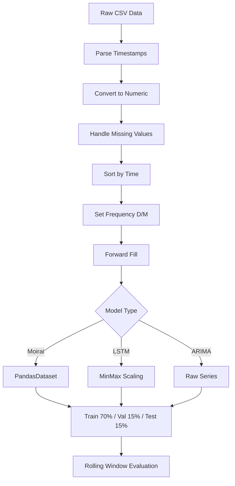

# 🚀 Time Series Forecasting dengan Moirai, LSTM, dan ARIMA

[](https://ts.gluon.ai/)
[](https://github.com/SalesforceAIResearch/uni2ts)

> **Framework Komprehensif untuk Forecasting Time Series** menggunakan Moirai Universal Transformer, LSTM, dan ARIMA pada multi-domain datasets (Weather, Finance, Environmental).

## 📊 Overview

Repository ini mengimplementasikan sistem forecasting lengkap dengan perbandingan fair antar berbagai metode state-of-the-art:

- **🎯 Zero-Shot Forecasting**: Moirai v2 - prediksi tanpa training
- **🎪 Few-Shot Forecasting**: Moirai-MoE - adaptasi model dengan data minimal (6 examples)
- **🤖 Deep Learning Baseline**: LSTM multi-layer dengan autoregressive forecasting
- **📈 Statistical Baseline**: ARIMA dengan automatic parameter selection
- **📊 Standardized Evaluation**: Perbandingan fair dengan konfigurasi seragam untuk semua model

## 🏗️ Architecture


```mermaid
graph LR
    A[Raw Data] --> B[Preprocessing]
    B --> C{Model Selection}
    C -->|Zero-Shot| D[Moirai v2]
    C -->|Few-Shot| E[Moirai-MoE]
    C -->|Deep Learning| F[LSTM Baseline]
    C -->|Statistical| G[ARIMA Baseline]
    D --> H[Standardized Evaluation]
    E --> H
    F --> H
    G --> H
    H --> I[Comparison & Analysis]
```

## 📁 Project Structure

```
forecast/
├── 📊 data/                              # Datasets
│   ├── weather_melbourne/                # Daily temperature (10 years)
│   ├── finance_aapl/                    # AAPL stock prices (10+ years)
│   └── co2_maunaloa_monthly/             # CO2 concentration (67 years)
├── 🎯 Model Scripts/
│   ├── run_zeroshot_all.py              # Zero-shot Moirai v2
│   └── run_fewshot_moe.py               # Few-shot Moirai-MoE
├── 📈 Baseline Scripts/
│   ├── baseline_lstm.py                 # LSTM implementation
│   └── baseline_arima.py                # ARIMA implementation
├── 📊 Analysis & Comparison/
│   ├── run_all_standardized.py          # Jalankan semua model dengan config seragam
│   └── analysis_standardized_results.py # Analisis & visualisasi hasil perbandingan
├── 🔧 Configuration/
│   └── light_config.py                  # Config standardized untuk semua dataset
├── 🛠️ Utilities/
│   └── prepare_dataset.py               # Download & prepare datasets
├── 📋 Results/
│   ├── results_zeroshot/                # Hasil Moirai v2
│   ├── results_fewshot_moe/             # Hasil Moirai-MoE
│   ├── results_baseline_lstm/           # Hasil LSTM
│   ├── results_baseline_arima/          # Hasil ARIMA
│   └── standardized_results/            # Hasil perbandingan standardized
└── 📚 uni2ts/                           # Moirai model framework
```

## 🚀 Quick Start

### 1) Instalasi (Windows PowerShell)

```powershell
# Clone repository
cd C:\Skripsi\forecast

# Buat virtual environment dan aktifkan
python -m venv venv
.\venv\Scripts\Activate.ps1

# Install dependencies
pip install -r requirements.txt

# (Opsional) Install uni2ts dari folder lokal jika belum
pip install -e ./uni2ts
```

### 2) Persiapan Data

```powershell
# Download dan persiapkan datasets (weather_melbourne, finance_aapl, co2_maunaloa_monthly)
python prepare_dataset.py
```

Output: `data/` folder berisi full/train/val/test splits untuk setiap dataset

### 3) Menjalankan Model Individual

#### Zero-Shot Forecasting (Moirai v2)

```powershell
python run_zeroshot_all.py
```

#### Few-Shot Forecasting (Moirai-MoE)

```powershell
python run_fewshot_moe.py
```

#### Baseline Methods

```powershell
# LSTM baseline
python baseline_lstm.py

# ARIMA baseline
python baseline_arima.py
```

### 4) Menjalankan Semua Model dengan Konfigurasi Standardized

Untuk perbandingan fair dengan konfigurasi seragam:

```powershell
# Jalankan semua model (zeroshot, fewshot, lstm, arima) dengan config yang sama
python run_all_standardized.py
```

### 5) Analisis Hasil Perbandingan

```powershell
# Analisis dan visualisasi hasil semua model
python analysis_standardized_results.py
```

Output: Grafik perbandingan, ranking model, dan statistik di `standardized_results/` dan `standardized_comparison/`

## 📊 Datasets

| Dataset               | Domain        | Frequency | Periode   | Deskripsi                     | Pred_len | Context_len |
| --------------------- | ------------- | --------- | --------- | ----------------------------- | -------- | ----------- |
| **Weather Melbourne** | Climate       | Daily     | ~10 years | Daily minimum temperatures    | 7 days   | 120 days    |
| **AAPL Stock**        | Finance       | Daily     | 10+ years | Apple stock closing prices    | 5 days   | 120 days    |
| **CO2 Mauna Loa**     | Environmental | Monthly   | ~67 years | Atmospheric CO2 concentration | 6 months | 120 months  |

**Note**: Semua datasets sudah disiapkan dalam format train/val/test dengan split ratio 70/15/15

## 🎯 Models & Methods

### 🌟 Moirai Universal Transformer

**Zero-Shot Forecasting (Moirai v2):**

- Pre-trained pada 100K+ time series dari berbagai domain
- Universal architecture yang bisa langsung inference tanpa training
- File: `run_zeroshot_all.py`

**Few-Shot Learning (Moirai-MoE):**

- Mixture of Experts variant untuk domain-specific adaptation
- Training dengan minimal examples (n_shots=6)
- File: `run_fewshot_moe.py`

### 🤖 Deep Learning Baseline (LSTM)

- **Architecture**: Multi-layer LSTM (1 layer, hidden_size=32)
- **Training**: Supervised learning pada historical data
- **Features**: Sequence-to-sequence autoregressive forecasting
- **Epochs**: 10, Batch size: 64
- **File**: `baseline_lstm.py`

### 📈 Statistical Baseline (ARIMA)

- **Method**: Auto-ARIMA dengan automatic parameter selection
- **Seasonality**: Adaptive seasonal detection
- **Optimization**: Fast mode dengan reduced search space (max_windows=6)
- **File**: `baseline_arima.py`

## 📋 Evaluation Metrics

| Metric    | Formula                                                       | Deskripsi              |
| --------- | ------------------------------------------------------------- | ---------------------- |
| **MAE**   | `mean(\|y_true - y_pred\|)`                                   | Mean Absolute Error    |
| **RMSE**  | `sqrt(mean((y_true - y_pred)²))`                              | Root Mean Square Error |
| **sMAPE** | `mean(\|y_pred - y_true\| / (\|y_true\| + \|y_pred\|)) * 100` | Symmetric MAPE (%)     |

**Note**: Metrik dihitung dengan rolling window evaluation untuk fairness

## 🎨 Visualization

Setiap model menghasilkan visualisasi hasil forecasting:

- **📈 Time Series Plots**: Ground truth vs predictions untuk setiap window
- **📊 Metrics Summary**: CSV files dengan MAE, RMSE, sMAPE per dataset
- **📋 JSON Metrics**: Detailed metrics untuk setiap hasil forecasting
- **🎯 Best Windows**: Identifikasi window dengan error terkecil

Output disimpan dalam folder `results_<model_name>/` untuk setiap dataset.

## 🔧 Configuration

### Hyperparameters per Dataset (dari `light_config.py`)

```python
STANDARD_CONFIG = {
    "weather_melbourne": {
        "csv": "data/weather_melbourne/weather_melbourne_full.csv",
        "pred_len": 7,              # Forecast 7 hari ke depan
        "context_len": 120,         # Gunakan 120 hari history
        "freq": "D",                # Daily frequency
        "lookback": 120,            # LSTM context window
        "n_shots": 6,               # Few-shot examples
        "max_windows": 6            # Max rolling windows
    },

    "finance_aapl": {
        "csv": "data/finance_aapl/finance_aapl_full.csv",
        "pred_len": 5,              # Forecast 5 hari ke depan
        "context_len": 120,
        "freq": "D",
        "lookback": 120,
        "n_shots": 6,
        "max_windows": 6
    },

    "co2_maunaloa_monthly": {
        "csv": "data/co2_maunaloa_monthly/co2_maunaloa_monthly_full.csv",
        "pred_len": 6,              # Forecast 6 bulan ke depan
        "context_len": 120,
        "freq": "M",                # Monthly frequency
        "lookback": 120,
        "n_shots": 6,
        "max_windows": 6
    },
}

LIGHT_TRAINING_CONFIG = {
    "lstm": {
        "epochs": 10,
        "batch_size": 64,
        "hidden_size": 32,
        "num_layers": 1,
        "learning_rate": 0.001
    },
    "arima": {
        "max_windows": 6,           # Batasi untuk kecepatan
        "max_p": 3,
        "max_q": 3,
        "seasonal": True
    }
}
```

## 📚 Dependencies

Semua dependencies sudah terdaftar di `requirements.txt`. Install dengan:

```bash
pip install -r requirements.txt
```

### Core Requirements

- **torch** >= 1.12.0 - Deep learning framework
- **pandas** >= 1.5.0 - Data manipulation
- **numpy** >= 1.21.0 - Numerical computing
- **matplotlib** >= 3.5.0 - Visualization
- **gluonts** >= 0.13.0 - Time series framework

### Model-Specific

- **transformers** >= 4.20.0 - Transformer models
- **huggingface-hub** >= 0.10.0 - Hugging Face integration
- **pmdarima** >= 2.0.0 - ARIMA implementation
- **scikit-learn** >= 1.1.0 - Preprocessing & scaling
- **seaborn** >= 0.11.0 - Statistical visualization
- **plotly** >= 5.10.0 - Interactive plots

## 🔄 Data Processing Pipeline


```mermaid
graph TD
    A["Raw CSV Data"] --> B["Parse Timestamps"]
    B --> C["Convert to Numeric"]
    C --> D["Handle Missing Values"]
    D --> E["Sort by Time"]
    E --> F["Set Frequency D/M"]
    F --> G["Forward Fill"]
    G --> H{Model Type}
    H -->|Moirai| I["PandasDataset"]
    H -->|LSTM| J["MinMax Scaling"]
    H -->|ARIMA| K["Raw Series"]
    I --> L["Train 70% / Val 15% / Test 15%"]
    J --> L
    K --> L
    L --> M["Rolling Window Evaluation"]
```

## 📈 Results Output

Setiap model menghasilkan hasil dalam folder `results_<model_name>/`:

```
results_<model_name>/
├── summary_<model>.csv              # Summary metrics per dataset
└── <dataset_name>/
    ├── <dataset>_<model>_metrics.json    # Detailed metrics
    └── <dataset>_<model>_forecasts.csv   # Predictions
```

**Standardized Comparison** (hasil dari `run_all_standardized.py`):

- `standardized_results/complete_comparison.csv` - Perbandingan semua model
- `standardized_results/ranking_summary.csv` - Ranking model per dataset
- `standardized_comparison/` - Grafik & visualisasi perbandingan

## 📝 Workflow Eksperimen

### 1️⃣ Setup Awal

```powershell
# Install dependencies
pip install -r requirements.txt

# Persiapkan data
python prepare_dataset.py
```

### 2️⃣ Jalankan Model Individual (Opsional)

```powershell
python run_zeroshot_all.py      # ~30 menit
python run_fewshot_moe.py       # ~40 menit
python baseline_lstm.py          # ~20 menit
python baseline_arima.py         # ~15 menit
```

### 3️⃣ Standardized Comparison (Recommended)

```powershell
# Jalankan semua model dengan config yang sama
python run_all_standardized.py
```

### 4️⃣ Analisis Hasil

```powershell
# Generate comparison analysis
python analysis_standardized_results.py

# Output: standardized_results/ dan standardized_comparison/
```

## 🎯 File Mapping

| Script                             | Tujuan                        | Output                                               |
| ---------------------------------- | ----------------------------- | ---------------------------------------------------- |
| `prepare_dataset.py`               | Download & prepare 3 datasets | `data/`                                              |
| `run_zeroshot_all.py`              | Moirai v2 forecasting         | `results_zeroshot/`                                  |
| `run_fewshot_moe.py`               | Moirai-MoE forecasting        | `results_fewshot_moe/`                               |
| `baseline_lstm.py`                 | LSTM forecasting              | `results_baseline_lstm/`                             |
| `baseline_arima.py`                | ARIMA forecasting             | `results_baseline_arima/`                            |
| `run_all_standardized.py`          | Jalankan semua model          | Semua results folders                                |
| `analysis_standardized_results.py` | Analisis & banding hasil      | `standardized_results/` + `standardized_comparison/` |
| `light_config.py`                  | Centralized configuration     | N/A                                                  |

## 🏆 Standardized Evaluation

Untuk perbandingan yang fair, `run_all_standardized.py` menjalankan semua model dengan:

- Konfigurasi **identical** untuk setiap dataset (dari `light_config.py`)
- **Prediction length** yang sama untuk forecasting
- **Context length** yang sama untuk historical data
- **Rolling window** evaluation dengan jumlah windows yang sama

Hasil comparison disimpan dengan struktur:

- `standardized_results/complete_comparison.csv` - Metrics semua model
- `standardized_results/ranking_summary.csv` - Ranking berdasarkan MAE
- `standardized_comparison/` - Visualization plots

## 🤝 Contributing

Jika ingin berkontribusi:

1. Buat feature branch (`git checkout -b feature/new-feature`)
2. Commit changes (`git commit -m 'Add new feature'`)
3. Push to branch (`git push origin feature/new-feature`)
4. Buka Pull Request

## 📄 License

Project ini menggunakan framework **uni2ts** dari Salesforce Research. Lihat [LICENSE.txt](LICENSE.txt) untuk detail lengkap.

## 🙏 Acknowledgments

- [Salesforce Research](https://github.com/SalesforceAIResearch/uni2ts) - Moirai Universal Transformer
- [GluonTS](https://ts.gluon.ai/) - Time series framework
- [Hugging Face](https://huggingface.co/) - Model hub
- [Auto-ARIMA (pmdarima)](https://alkaline-ml.com/pmdarima/) - Statistical forecasting

---

**Last Updated**: January 2, 2026
